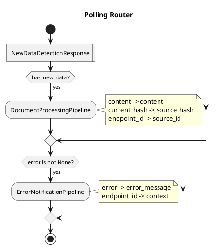

# Pipeline and MultiplexRouter Design Proposal

## Summary

This proposal defines the architecture for durable workflow orchestration in julee:

1. **Pipeline**: Thin wrapper around exactly one UseCase, providing Temporal durability
2. **MultiplexRouter**: Declarative routing from responses to downstream pipelines
3. **Route**: A single routing rule with introspectable conditions and field mappings

## Core Principles

| Principle | Implication |
|-----------|-------------|
| UseCase is atomic | Business logic + compensation lives in UseCase |
| Pipeline is thin | Only: wrap UseCase, consult router, dispatch |
| Response is pure domain | No orchestration concerns leak into Response |
| Routes are declarative | Conditions and mappings are data, not lambdas |
| Configuration is visualizable | Can generate PlantUML from route definitions |

---

## Domain Models

### Route

A single routing rule that maps a response to a downstream pipeline.

```python
# Location: src/julee/shared/domain/models/route.py

from enum import Enum
from typing import Any

from pydantic import BaseModel


class Operator(str, Enum):
    """Comparison operators for field conditions."""

    EQ = "eq"           # field == value
    NE = "ne"           # field != value
    GT = "gt"           # field > value
    GE = "ge"           # field >= value
    LT = "lt"           # field < value
    LE = "le"           # field <= value
    IS_TRUE = "is_true"       # field is True
    IS_FALSE = "is_false"     # field is False
    IS_NONE = "is_none"       # field is None
    IS_NOT_NONE = "is_not_none"  # field is not None
    IN = "in"           # field in value (value is list)
    NOT_IN = "not_in"   # field not in value


class FieldCondition(BaseModel):
    """A single condition on a response field."""

    field: str                    # Response field name (supports dot notation: "result.status")
    operator: Operator            # Comparison operator
    value: Any = None             # Comparison value (not needed for is_true, is_none, etc.)

    def evaluate(self, response: BaseModel) -> bool:
        """Evaluate this condition against a response."""
        # Get field value (supports nested fields via dot notation)
        field_value = self._get_field_value(response, self.field)

        match self.operator:
            case Operator.EQ:
                return field_value == self.value
            case Operator.NE:
                return field_value != self.value
            case Operator.GT:
                return field_value > self.value
            case Operator.GE:
                return field_value >= self.value
            case Operator.LT:
                return field_value < self.value
            case Operator.LE:
                return field_value <= self.value
            case Operator.IS_TRUE:
                return field_value is True
            case Operator.IS_FALSE:
                return field_value is False
            case Operator.IS_NONE:
                return field_value is None
            case Operator.IS_NOT_NONE:
                return field_value is not None
            case Operator.IN:
                return field_value in self.value
            case Operator.NOT_IN:
                return field_value not in self.value

        return False

    def _get_field_value(self, obj: BaseModel, field_path: str) -> Any:
        """Get nested field value using dot notation."""
        value = obj
        for part in field_path.split("."):
            value = getattr(value, part, None)
            if value is None:
                break
        return value

    def __str__(self) -> str:
        """Human-readable representation for visualization."""
        match self.operator:
            case Operator.IS_TRUE:
                return f"{self.field}"
            case Operator.IS_FALSE:
                return f"not {self.field}"
            case Operator.IS_NONE:
                return f"{self.field} is None"
            case Operator.IS_NOT_NONE:
                return f"{self.field} is not None"
            case Operator.IN:
                return f"{self.field} in {self.value}"
            case Operator.NOT_IN:
                return f"{self.field} not in {self.value}"
            case _:
                op_symbols = {"eq": "==", "ne": "!=", "gt": ">", "ge": ">=", "lt": "<", "le": "<="}
                return f"{self.field} {op_symbols.get(self.operator.value, self.operator.value)} {self.value!r}"


class Condition(BaseModel):
    """A compound condition (AND of multiple field conditions)."""

    all_of: list[FieldCondition]  # All conditions must be true

    def evaluate(self, response: BaseModel) -> bool:
        """Evaluate all conditions (AND logic)."""
        return all(cond.evaluate(response) for cond in self.all_of)

    def __str__(self) -> str:
        """Human-readable representation."""
        if len(self.all_of) == 1:
            return str(self.all_of[0])
        return " AND ".join(f"({cond})" for cond in self.all_of)

    @classmethod
    def when(cls, field: str, operator: Operator, value: Any = None) -> "Condition":
        """Factory for simple single-field conditions."""
        return cls(all_of=[FieldCondition(field=field, operator=operator, value=value)])

    @classmethod
    def is_true(cls, field: str) -> "Condition":
        """Factory: field is True."""
        return cls.when(field, Operator.IS_TRUE)

    @classmethod
    def is_not_none(cls, field: str) -> "Condition":
        """Factory: field is not None."""
        return cls.when(field, Operator.IS_NOT_NONE)


class FieldMapping(BaseModel):
    """Maps a response field to a request field."""

    source: str       # Response field (supports dot notation)
    target: str       # Request field name

    def __str__(self) -> str:
        if self.source == self.target:
            return self.source
        return f"{self.source} -> {self.target}"


class Route(BaseModel):
    """A routing rule: response condition -> pipeline + request.

    A Route is declarative and introspectable. It defines:
    - Which response type it handles
    - What condition must be true
    - Which pipeline to trigger
    - How to build the request from the response
    """

    # What this route matches
    response_type: str            # Fully qualified class name of Response
    condition: Condition          # When to trigger this route

    # What this route produces
    pipeline: str                 # Target pipeline name
    request_type: str             # Fully qualified class name of Request
    field_mappings: list[FieldMapping]  # How to build request from response

    # Optional metadata
    description: str = ""         # Human-readable description

    def matches(self, response: BaseModel) -> bool:
        """Check if this route matches the given response."""
        # Check type match
        response_fqn = f"{response.__class__.__module__}.{response.__class__.__name__}"
        if response_fqn != self.response_type:
            # Also try just class name for simpler configs
            if response.__class__.__name__ != self.response_type.split(".")[-1]:
                return False

        # Check condition
        return self.condition.evaluate(response)

    def build_request(self, response: BaseModel) -> BaseModel:
        """Build the target request from the response."""
        # Import the request type
        request_class = self._import_class(self.request_type)

        # Build kwargs from field mappings
        kwargs = {}
        for mapping in self.field_mappings:
            value = self._get_field_value(response, mapping.source)
            kwargs[mapping.target] = value

        return request_class(**kwargs)

    def _get_field_value(self, obj: BaseModel, field_path: str) -> Any:
        """Get nested field value using dot notation."""
        value = obj
        for part in field_path.split("."):
            value = getattr(value, part, None)
            if value is None:
                break
        return value

    def _import_class(self, fqn: str) -> type:
        """Import a class from its fully qualified name."""
        module_path, class_name = fqn.rsplit(".", 1)
        import importlib
        module = importlib.import_module(module_path)
        return getattr(module, class_name)
```

### MultiplexRouter

Routes responses to zero or more downstream pipelines.

```python
# Location: src/julee/shared/domain/models/multiplex_router.py

from pydantic import BaseModel


class MultiplexRouter(BaseModel):
    """Routes responses to downstream pipelines.

    A MultiplexRouter contains a list of Routes and matches responses
    against them. Multiple routes can match the same response (multiplex).

    The router is declarative and can be:
    - Configured in code
    - Serialized to/from JSON/YAML
    - Visualized as PlantUML
    """

    name: str                     # Router identifier
    description: str = ""         # Human-readable description
    routes: list[Route] = []      # Routing rules

    def route(self, response: BaseModel) -> list[Route]:
        """Return all routes that match this response."""
        return [route for route in self.routes if route.matches(response)]

    def add_route(self, route: Route) -> "MultiplexRouter":
        """Add a route (fluent API)."""
        self.routes.append(route)
        return self

    def to_plantuml(self) -> str:
        """Generate PlantUML activity diagram."""
        lines = [
            "@startuml",
            f"title {self.name}",
            "",
            "start",
        ]

        # Group routes by response type
        routes_by_response: dict[str, list[Route]] = {}
        for route in self.routes:
            response_name = route.response_type.split(".")[-1]
            if response_name not in routes_by_response:
                routes_by_response[response_name] = []
            routes_by_response[response_name].append(route)

        for response_name, routes in routes_by_response.items():
            lines.append(f":{response_name}|")
            lines.append("")

            for route in routes:
                condition_str = str(route.condition)
                pipeline_name = route.pipeline.split(".")[-1]

                lines.append(f"if ({condition_str}?) then (yes)")
                lines.append(f"  :{pipeline_name};")

                # Add field mapping note
                if route.field_mappings:
                    mapping_strs = [str(m) for m in route.field_mappings]
                    lines.append(f"  note right: {chr(92)}n".join(mapping_strs))

                lines.append("endif")
                lines.append("")

        lines.extend([
            "stop",
            "@enduml",
        ])

        return "\n".join(lines)
```

### Pipeline (Revised Doctrine)

```python
# Location: src/julee/shared/domain/models/pipeline.py (updated docstring)

class Pipeline(BaseModel):
    """A Pipeline in julee's Temporal workflow pattern.

    A Pipeline is a thin durability wrapper around exactly ONE UseCase.

    DOCTRINE:

    1. EXACTLY ONE UseCase
       - Pipeline wraps exactly one UseCase
       - UseCase contains all business logic including compensation
       - Pipeline does not contain business logic

    2. THIN WRAPPER
       The Pipeline's run() method does exactly three things:
       a) Execute the UseCase with workflow-safe proxies
       b) Consult the MultiplexRouter for downstream routes
       c) Dispatch to matched pipelines

    3. DECLARATIVE ROUTING
       - Routing is configured via MultiplexRouter
       - Routes are declarative (conditions + mappings, not lambdas)
       - Pipeline dumbly follows router's advice

    4. TEMPORAL CONCERNS ONLY
       Pipeline may handle:
       - @workflow.defn, @workflow.run decorators
       - Workflow queries (@workflow.query)
       - Getting last completion result
       - Starting child workflows

       Pipeline must NOT handle:
       - Business logic
       - Data transformation
       - Conditional logic beyond "for each matched route, dispatch"

    STRUCTURE:

        @workflow.defn
        class {Name}Pipeline:
            @workflow.run
            async def run(self, request: dict) -> dict:
                # 1. Execute UseCase
                response = await {Name}UseCase(
                    repo=WorkflowRepoProxy(),
                    service=WorkflowServiceProxy(),
                ).execute({Name}Request(**request))

                # 2. Route to downstream pipelines
                for route in router.route(response):
                    request = route.build_request(response)
                    await workflow.start_child_workflow(
                        route.pipeline,
                        args=[request.model_dump()],
                    )

                # 3. Return response
                return response.model_dump()
    """
```

---

## File Structure

```
src/julee/shared/
├── domain/
│   └── models/
│       ├── __init__.py
│       ├── route.py              # Route, Condition, FieldCondition, FieldMapping
│       ├── multiplex_router.py   # MultiplexRouter
│       └── pipeline.py           # Pipeline (updated)
│
src/julee/contrib/polling/
├── domain/
│   └── use_cases/
│       ├── new_data_detection.py     # UseCase
│       ├── requests.py               # NewDataDetectionRequest
│       └── responses.py              # NewDataDetectionResponse
├── apps/
│   └── worker/
│       ├── pipelines.py              # NewDataDetectionPipeline
│       └── routes.py                 # Router configuration
```

---

## Example: Polling Router Configuration

```python
# Location: src/julee/contrib/polling/apps/worker/routes.py

from julee.shared.domain.models.route import (
    Condition,
    FieldMapping,
    Operator,
    Route,
)
from julee.shared.domain.models.multiplex_router import MultiplexRouter


polling_router = MultiplexRouter(
    name="Polling Router",
    description="Routes polling responses to downstream processing pipelines",
    routes=[
        Route(
            response_type="julee.contrib.polling.domain.use_cases.responses.NewDataDetectionResponse",
            condition=Condition.is_true("has_new_data"),
            pipeline="julee.contrib.docproc.apps.worker.pipelines.DocumentProcessingPipeline",
            request_type="julee.contrib.docproc.domain.use_cases.requests.ProcessDocumentRequest",
            field_mappings=[
                FieldMapping(source="content", target="content"),
                FieldMapping(source="current_hash", target="source_hash"),
                FieldMapping(source="endpoint_id", target="source_id"),
            ],
            description="When new data detected, trigger document processing",
        ),
        Route(
            response_type="julee.contrib.polling.domain.use_cases.responses.NewDataDetectionResponse",
            condition=Condition.is_not_none("error"),
            pipeline="julee.shared.apps.worker.pipelines.ErrorNotificationPipeline",
            request_type="julee.shared.domain.use_cases.requests.NotifyErrorRequest",
            field_mappings=[
                FieldMapping(source="error", target="error_message"),
                FieldMapping(source="endpoint_id", target="context"),
            ],
            description="When polling fails, notify error handler",
        ),
    ],
)
```

---

## Example: Compliant Pipeline

```python
# Location: src/julee/contrib/polling/apps/worker/pipelines.py

from temporalio import workflow

from julee.contrib.polling.domain.use_cases.new_data_detection import (
    NewDataDetectionUseCase,
)
from julee.contrib.polling.domain.use_cases.requests import NewDataDetectionRequest
from julee.contrib.polling.infrastructure.temporal.proxies import (
    WorkflowPollerServiceProxy,
)

from .routes import polling_router


@workflow.defn
class NewDataDetectionPipeline:
    """Pipeline for detecting new data from polled endpoints.

    Wraps NewDataDetectionUseCase with Temporal durability.
    Routes to downstream pipelines based on response.
    """

    @workflow.run
    async def run(self, request: dict) -> dict:
        # 1. Get previous state (Temporal concern)
        previous = workflow.get_last_completion_result()
        if previous:
            request["previous_hash"] = previous.get("current_hash")

        # 2. Execute UseCase (business logic)
        response = await NewDataDetectionUseCase(
            poller_service=WorkflowPollerServiceProxy(),
        ).execute(NewDataDetectionRequest(**request))

        # 3. Route to downstream pipelines (declarative)
        for route in polling_router.route(response):
            next_request = route.build_request(response)
            await workflow.start_child_workflow(
                route.pipeline,
                args=[next_request.model_dump()],
            )

        # 4. Return response (for next completion)
        return response.model_dump()
```

---

## Generated PlantUML

```python
print(polling_router.to_plantuml())
```



---

## Doctrine Tests

### Route Doctrine

```python
# Location: src/julee/shared/tests/domain/models/test_route_doctrine.py

class TestRouteDoctrine:
    """Doctrine for Route configuration."""

    def test_route_MUST_have_response_type(self):
        """A Route MUST specify which response type it handles."""

    def test_route_MUST_have_condition(self):
        """A Route MUST have a condition (even if always-true)."""

    def test_route_MUST_have_target_pipeline(self):
        """A Route MUST specify a target pipeline."""

    def test_route_MUST_have_request_type(self):
        """A Route MUST specify the request type to build."""

    def test_route_field_mappings_MUST_be_valid(self):
        """All field mappings must reference valid source fields."""

    def test_condition_MUST_be_introspectable(self):
        """Conditions must be declarative, not lambdas."""
```

### Pipeline Doctrine (Updated)

```python
# Location: src/julee/shared/tests/domain/use_cases/test_pipeline_doctrine.py

class TestPipelineDoctrine:
    """Updated doctrine for Pipelines."""

    def test_pipeline_MUST_wrap_exactly_one_usecase(self):
        """A Pipeline MUST delegate to exactly one UseCase."""

    def test_pipeline_MUST_use_declarative_routing(self):
        """A Pipeline MUST use MultiplexRouter, not inline conditionals."""

    def test_pipeline_MUST_NOT_contain_business_logic(self):
        """A Pipeline MUST NOT contain if/else business decisions."""
```

---

## Migration Path

### Current State (Non-compliant)

```python
# NewDataDetectionPipeline contains business logic
@workflow.run
async def run(self, config):
    # ... 200+ lines of business logic ...
    current_hash = hashlib.sha256(...)  # Business logic in pipeline!
    if previous_hash != current_hash:   # Business logic in pipeline!
        ...
```

### Target State (Compliant)

1. **Extract UseCase**: Move business logic to `NewDataDetectionUseCase`
2. **Define Response**: Create `NewDataDetectionResponse` with all needed fields
3. **Configure Router**: Define routes declaratively
4. **Thin Pipeline**: Pipeline becomes ~20 lines

---

## Open Questions

1. **Router location**: Per-pipeline, per-bounded-context, or global?
   - Recommendation: Per-bounded-context in `apps/worker/routes.py`

2. **Dynamic routes**: Should routes be loadable from database?
   - Recommendation: Start with code config, add persistence later if needed

3. **OR conditions**: Current design uses AND. Need OR support?
   - Recommendation: Add `any_of` to Condition if needed

4. **Complex mappings**: What if request field needs transformation?
   - Recommendation: Add optional `transform` field to FieldMapping, or keep complex transforms in UseCase

---

## Success Criteria

1. Pipeline doctrine tests pass
2. Route doctrine tests pass
3. Existing `NewDataDetectionPipeline` refactored to comply
4. PlantUML generation works
5. `julee-admin doctrine show` includes routing documentation
