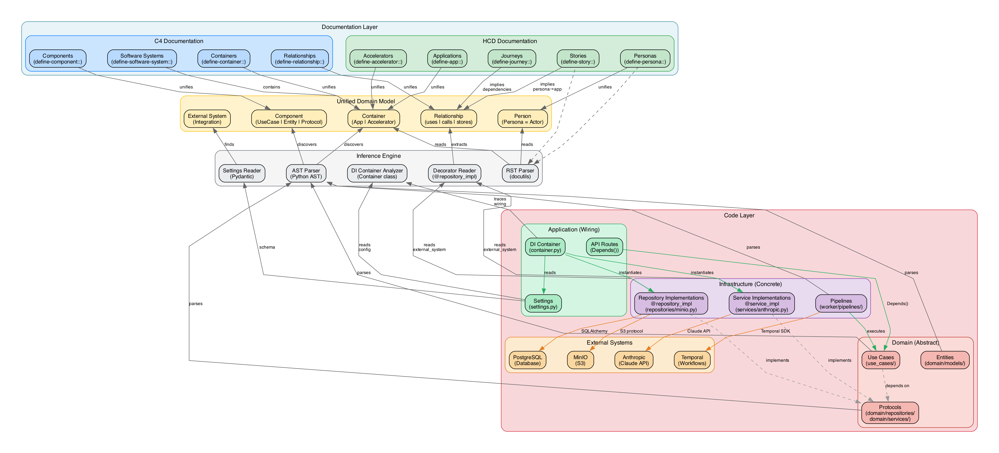

# Enhancement Proposal: C4 Inference from Clean Architecture Idioms

## Summary

Extend the Julee documentation extensions to automatically infer C4 architectural
elements from clean architecture conventions, and unify HCD and C4 concepts where
they represent the same underlying reality. Rather than maintaining separate
definitions for personas/actors, accelerators/containers, and integrations/external
systems, a single definition should serve both documentation perspectives.

## Architecture Overview

The following diagram shows how documentation, unified models, inference engines,
and code layers connect - from RST directives at the top down to external systems
at the bottom:



**Key insight**: Documentation and code are both sources of truth. The inference
engine reads from both, populating a unified domain model that serves HCD and C4
views without duplication.

## Motivation

Julee solutions follow strict conventions (ADR 001) that encode architectural
intent in directory structure and code organisation:

- Bounded contexts as top-level packages in `src/`
- Domain layer with models, repository protocols, service protocols
- Use cases as application business rules
- Infrastructure with the three-layer Temporal pattern
- Apps directory with api, cli, worker entry points

These conventions are **already C4 information** expressed in a different form.
Manually transcribing this into C4 documentation creates:

1. **Duplication** - The same architectural facts exist in two places
2. **Drift risk** - Code changes but C4 docs don't get updated
3. **Effort** - Writing C4 definitions for well-structured code feels redundant

The principle from ADR 003 (sphinx-hcd) applies here: *"documentation that is
DRY, derives from authoritative sources, and reflects code reality."*

## Concept Unification

### The Problem with Separate Models

Currently, HCD and C4 maintain parallel concepts:

| HCD Concept | C4 Concept | Reality |
|-------------|------------|---------|
| Persona | Person/Actor | Same: a type of user |
| Application | Container | Same: an entry point |
| Accelerator | Container | Same: a bounded context |
| Integration | External System | Same: external dependency |

Maintaining these separately means:
- Defining the same thing twice in different vocabularies
- Risk of inconsistency between perspectives
- Extra work for documentation authors

### Unified Model Proposal

Instead of a "bridge" between HCD and C4, **unify the underlying model**:

```
                    ┌─────────────────┐
                    │  Unified Model  │
                    │                 │
                    │  - Person       │
                    │  - Container    │
                    │  - Component    │
                    │  - Relationship │
                    └────────┬────────┘
                             │
              ┌──────────────┼──────────────┐
              │              │              │
              ▼              ▼              ▼
        ┌──────────┐  ┌──────────┐  ┌──────────┐
        │   HCD    │  │    C4    │  │   Code   │
        │   View   │  │   View   │  │   View   │
        │          │  │          │  │          │
        │ Personas │  │  Actors  │  │ Protocols│
        │ Journeys │  │ Diagrams │  │ Classes  │
        │ Stories  │  │ Levels   │  │ Imports  │
        └──────────┘  └──────────┘  └──────────┘
```

A single `define-persona::` directive creates an entity that appears as:
- A **Persona** in HCD documentation (journeys, stories, epics)
- An **Actor** in C4 system context diagrams
- A **User type** in requirements traceability

### Specific Unifications

#### Persona = C4 Person

HCD personas are the subjects of stories and journeys. C4 Person elements are
actors who interact with software systems. **They are the same concept.**

```rst
.. define-persona:: solutions-developer
   :name: Solutions Developer
   :goals:
      Build reliable workflow solutions

   A developer building production systems with Julee.
```

This single definition should:
- Appear in HCD persona indexes and journey diagrams
- Appear as an actor in C4 system context diagrams
- Link stories to the C4 components that satisfy them

#### Application = C4 Container (Entry Point)

HCD applications are entry points exposing features to personas. C4 containers
are deployable units. **An application IS a container.**

```rst
.. define-app:: staff-portal
   :type: api
   :personas: Knowledge Curator, Solutions Developer
```

Should automatically create a C4 container with:
- Technology inferred from type (api → FastAPI, cli → Typer, worker → Temporal)
- Relationships to personas (actors use this container)
- Relationships to accelerators it depends on

#### Accelerator = C4 Container (Bounded Context)

HCD accelerators are bounded contexts with pipelines. C4 containers are
separately deployable units. **An accelerator IS a container.**

The existing `define-accelerator::` directive already does code introspection.
This should additionally:
- Register a C4 container
- Populate components from introspected entities, use cases, protocols
- Infer relationships from import analysis

#### Integration = C4 External System

HCD integrations document external system connections. C4 external systems are
things outside the system boundary. **They are the same.**

```rst
.. define-integration:: temporal-cloud
   :type: workflow-orchestration
   :direction: outbound
```

Should create both an HCD integration AND a C4 external system.

## Idiom Refinements

To better support inference and unification, consider refining the conventions:

### 1. Explicit Container Type in Accelerators

Add a container classification to accelerators:

```rst
.. define-accelerator:: vocabulary
   :container-type: bounded-context
   :technology: Python
```

Or infer from directory structure:
- `src/{name}/` with domain/ → bounded-context container
- `apps/api/` → api container
- `apps/worker/` → worker container

### 2. Persona References Create Relationships

When a story references a persona and an app:

```rst
.. define-story:: upload-document
   :persona: Knowledge Curator
   :app: staff-portal
```

This implies a C4 relationship: `Knowledge Curator → uses → staff-portal`

### 3. App-Accelerator Dependencies

When an app declares accelerator dependencies:

```yaml
# apps/staff-portal/app.yaml
accelerators:
  - vocabulary
  - assessment
```

This implies C4 relationships: `staff-portal → uses → vocabulary`

### 4. Service Protocols Imply External Systems

Classes in `domain/services/` that wrap external APIs could be parsed to
discover external system dependencies:

```python
# domain/services/anthropic.py
class AnthropicService(Protocol):
    """Client for Anthropic Claude API."""
```

Implies external system: `Anthropic Claude API`

### 5. Standard Naming Conventions

Strengthen naming conventions to improve inference:

| Convention | Inferred As |
|------------|-------------|
| `*Repository` protocol | Data store component |
| `*Service` protocol | External service component |
| `*UseCase` class | Business logic component |
| `*Pipeline` class | Workflow component |

## Inferred C4 Elements

### From Directory Structure

```
Clean Architecture          →  C4 Model
─────────────────────────────────────────────────────
Solution repository         →  Software System
apps/api/                   →  Container (API)
apps/cli/                   →  Container (CLI)
apps/worker/                →  Container (Worker)
src/{bounded-context}/      →  Container (per domain)
```

### From AST Introspection

```
Code Structure              →  C4 Components
─────────────────────────────────────────────────────
domain/models/ classes      →  Entity Components
use_cases/ classes          →  Use Case Components
domain/repositories/        →  Protocol Components
domain/services/            →  Protocol Components
worker/pipelines/           →  Pipeline Components
```

### From Import Analysis

```
Import Pattern              →  C4 Relationship
─────────────────────────────────────────────────────
UseCase imports Repository  →  "reads from / writes to"
UseCase imports Service     →  "uses"
Pipeline imports UseCase    →  "executes"
API route imports UseCase   →  "exposes"
```

### From HCD Entities

```
HCD Declaration             →  C4 Element
─────────────────────────────────────────────────────
define-persona::            →  Person (actor)
define-app::                →  Container (entry point)
define-accelerator::        →  Container (bounded context)
define-integration::        →  External System
story :persona: :app:       →  Relationship (uses)
```

## Implementation Approach

### Shared Domain Model

Create unified domain models that serve both perspectives:

```python
class Person(BaseModel):
    """Unified person/persona model."""
    slug: str
    name: str
    # HCD attributes
    goals: list[str]
    frustrations: list[str]
    jobs_to_be_done: list[str]
    # C4 attributes
    is_external: bool = True  # C4: external actor

class Container(BaseModel):
    """Unified container model."""
    slug: str
    name: str
    # Classification
    container_type: Literal["api", "cli", "worker", "bounded-context"]
    technology: str
    # HCD attributes (if bounded-context)
    pipelines: list[str]
    # C4 attributes
    components: list[Component]
```

### Single Directive, Multiple Views

Each directive populates the unified model:

```rst
.. define-persona:: knowledge-curator
   :name: Knowledge Curator
   :goals: Build comprehensive vocabulary
```

The persona appears in:
- `persona-index::` (HCD view)
- `system-context-diagram::` (C4 view)
- `journeys-for-persona::` (HCD view)

### Inference Directives

For elements that can be fully inferred:

```rst
.. infer-containers::
   :from: apps/, src/

.. infer-components::
   :container: vocabulary

.. infer-relationships::
   :scope: vocabulary
```

### Hybrid Mode

Allow explicit definitions to supplement or override inference:

```rst
.. infer-external-systems::
   :from: docker-compose, service-protocols

.. define-external-system:: legacy-mainframe
   :description: Not discoverable, must be explicit
```

## Open Questions

### Unified vs Federated Model

Should HCD and C4 share a single repository, or have separate repositories
with cross-references?

- **Unified**: Simpler, guarantees consistency
- **Federated**: More flexible, allows independent evolution

### Inference Completeness

Import analysis may miss:
- Dependency injection (runtime wiring)
- Dynamic imports
- Configuration-driven relationships

Options:
- Accept incompleteness, allow manual supplementation
- Parse DI container configuration
- Warn about gaps

### Diagram Layout

C4 diagrams need spatial layout. Options:
- Auto-layout (PlantUML default)
- Hint-based layout (suggest positions)
- Manual layout with inferred content

### Granularity of Components

How deep should component inference go?
- Just top-level classes?
- Include methods as sub-components?
- Include class relationships?

## Success Criteria

1. **Single source of truth**: Define once, appear in both HCD and C4 views
2. **Automatic inference**: Well-structured code needs minimal explicit C4
3. **Consistency guaranteed**: Cannot have persona without corresponding actor
4. **Progressive detail**: System context auto-generated, component diagrams
   can be elaborated manually
5. **Traceability**: Navigate from persona → story → component → code

## Literate Architecture Idioms

Beyond inference from existing conventions, we could refine the conventions
themselves to be more self-describing and machine-readable. The goal is
**literate architecture**: code that declares its architectural role explicitly,
readable by both humans and tooling.

### Current State

Today's conventions rely on:

1. **Directory structure** - `domain/models/`, `use_cases/`, etc.
2. **Naming conventions** - `*Repository`, `*UseCase`, `*Service`
3. **Prose docstrings** - Human-readable but not machine-parseable

```python
# Current: Architectural role implied by location and naming
class ExtractAssembleDataUseCase:
    """
    Use case for extracting and assembling documents...

    Architectural Notes:
    - This class contains pure business logic...
    - Repository dependencies are injected via constructor...
    """
```

This works for humans reading the code, but tooling must infer intent from
heuristics.

### Proposed Enhancements

#### 1. Protocols vs Implementations (Abstract vs Concrete)

The key architectural distinction:

- **Protocols are abstract** - they define contracts without knowing about external systems
- **Implementations are concrete** - they know about MinIO, PostgreSQL, Anthropic, etc.
- **DI container wiring** determines what's actually deployed

Use cases depend on protocols (abstract):

```python
class ExtractAssembleDataUseCase:
    def __init__(
        self,
        document_repo: DocumentRepository,    # Protocol - abstract
        assembly_repo: AssemblyRepository,    # Protocol - abstract
        knowledge_service: KnowledgeService,  # Protocol - abstract
    ):
```

Protocols define the contract without external knowledge:

```python
class DocumentRepository(Protocol):
    """Repository for document storage and retrieval."""
    async def get(self, id: str) -> Document | None: ...
    async def save(self, entity: Document) -> None: ...
```

**Implementations** are where external systems become visible. Decorators on
implementations (not protocols) declare concrete dependencies:

```python
from julee.architecture import repository_impl, service_impl

@repository_impl(
    implements=DocumentRepository,
    external_system="minio",
    technology="S3",
)
class MinioDocumentRepository:
    """Stores documents in MinIO via S3 protocol."""

    def __init__(self, client: MinioClient, bucket: str):
        self.client = client
        self.bucket = bucket

@repository_impl(
    implements=DocumentRepository,
    external_system="postgresql",
    technology="SQLAlchemy",
)
class PostgresDocumentRepository:
    """Stores documents in PostgreSQL."""

    def __init__(self, session: AsyncSession):
        self.session = session

@service_impl(
    implements=KnowledgeService,
    external_system="anthropic",
    technology="Claude API",
)
class AnthropicKnowledgeService:
    """Extracts knowledge using Anthropic Claude."""

    def __init__(self, client: AnthropicClient):
        self.client = client
```

This is **not duplication** because:
1. Use case constructors declare *what* they need (protocols)
2. Implementation decorators declare *how* they fulfil it (external systems)
3. Different deployments can wire different implementations

Introspection can now:
1. Parse use case `__init__` to find protocol dependencies
2. Find all implementations of each protocol
3. Read `external_system` from implementation decorators
4. Check DI container config to see which implementation is wired

#### 2. Bounded Context Manifest

A `context.yaml` or structured `__init__.py` docstring declaring the context:

```yaml
# src/vocabulary/context.yaml
name: Vocabulary
type: bounded-context
objective: Manage domain terminology and semantic relationships

entities:
  - Term
  - Concept
  - Relationship

use_cases:
  - CreateTerm
  - MapConcepts
  - ResolveAmbiguity

repository_protocols:
  - TermRepository
  - ConceptRepository

service_protocols:
  - OntologyService

dependencies:
  - assessment  # uses assessment context for validation
```

Or as a structured docstring (parseable as YAML front matter):

```python
"""
---
name: Vocabulary
type: bounded-context
objective: Manage domain terminology and semantic relationships
entities: [Term, Concept, Relationship]
use_cases: [CreateTerm, MapConcepts, ResolveAmbiguity]
dependencies: [assessment]
---

Vocabulary bounded context.

This context handles all terminology management, including term creation,
concept mapping, and semantic relationship tracking.
"""
```

#### 3. DI Container and Settings Introspection

The DI container is the source of truth for what's actually deployed. Introspect
the container configuration to understand concrete wiring:

```python
# settings.py - declares what implementations are configured
class Settings(BaseSettings):
    # Repository backend selection
    document_backend: Literal["minio", "postgres", "memory"] = "minio"
    assembly_backend: Literal["minio", "postgres", "memory"] = "minio"

    # External system connection details
    minio_endpoint: str = "minio:9000"
    minio_access_key: str
    minio_secret_key: str

    postgres_dsn: str = ""

    anthropic_api_key: str
    anthropic_model: str = "claude-sonnet-4-20250514"

    temporal_host: str = "temporal:7233"
    temporal_namespace: str = "default"
```

```python
# container.py - wires implementations based on settings
class Container:
    def __init__(self, settings: Settings):
        self.settings = settings

    @cached_property
    def document_repo(self) -> DocumentRepository:
        if self.settings.document_backend == "minio":
            return MinioDocumentRepository(self.minio_client, "documents")
        elif self.settings.document_backend == "postgres":
            return PostgresDocumentRepository(self.session)
        else:
            return MemoryDocumentRepository()

    @cached_property
    def knowledge_service(self) -> KnowledgeService:
        return AnthropicKnowledgeService(self.anthropic_client)
```

Introspection can:
1. Parse `Settings` class to find external system configuration fields
2. Parse `Container` class to see which implementations are returned
3. Cross-reference with `@repository_impl` / `@service_impl` decorators
4. Build the complete external dependency graph for a deployment

#### 4. Relationship Semantics (Optional Disambiguation)

Most relationships can be inferred from the protocol type:
- `RepositoryProtocol` → "reads from / writes to" (data access)
- `ServiceProtocol` → "uses" (internal service)
- `ExternalServiceProtocol` → "calls" (external system)

For finer-grained semantics (read-only vs read-write), use `Annotated` **only when
disambiguation is needed**:

```python
def __init__(
    self,
    # No annotation needed - default is read/write for repositories
    document_repo: DocumentRepository,

    # Annotation adds semantics without repeating the type
    audit_repo: Annotated[AuditRepository, WriteOnly],
    cache: Annotated[CacheService, ReadOnly],
):
```

This is **additive metadata**, not duplication. The type (`AuditRepository`) declares
*what* it is; the annotation (`WriteOnly`) declares *how* it's used.

Alternatively, relationship semantics could be inferred from protocol method names:
- Protocol has `get`, `list`, `find` → supports reads
- Protocol has `save`, `delete`, `update` → supports writes
- This makes even `Annotated` unnecessary in most cases

#### 5. Pipeline-to-UseCase Relationships

Pipelines (Temporal workflows) wrap use cases. This relationship can be inferred:

```python
class ExtractAssemblePipeline:
    """Temporal workflow for document assembly."""

    @workflow.run
    async def run(self, document_id: str) -> Assembly:
        # The use case instantiation reveals the relationship
        use_case = ExtractAssembleDataUseCase(
            document_repo=DocumentRepositoryProxy(),
            assembly_repo=AssemblyRepositoryProxy(),
            ...
        )
        return await use_case.assemble_data(document_id, ...)
```

Introspection can:
1. Find workflow classes (decorated with `@workflow.defn`)
2. Parse their `run` method to find use case instantiations
3. Infer: pipeline "implements" use case

If explicit declaration is preferred, a minimal marker suffices:

```python
class ExtractAssemblePipeline:
    """Temporal workflow for document assembly."""
    implements = ExtractAssembleDataUseCase  # Class attribute, not decorator
```

#### 6. App Entry Points

API routes already have typed dependencies via FastAPI's dependency injection:

```python
@router.post("/documents/{id}/process")
async def process_document(
    id: str,
    use_case: ExtractAssembleDataUseCase = Depends(get_extract_assemble_use_case),
):
    ...
```

Introspection can parse the `Depends()` parameters to discover which use cases
each route exposes. No additional decorators needed.

For persona associations, the existing HCD story system already captures this:

```rst
.. define-story:: process-document
   :persona: Solutions Developer
   :app: api
```

The story links persona → app → use case. No need to repeat in code.

### Implementation Approach

#### Phase 1: Implementation Decorators

Add decorators for repository and service implementations that declare their
external system dependencies:

```python
# Existing code continues to work via heuristics
class MinioDocumentRepository:
    pass

# Decorated code enables precise inference
@repository_impl(implements=DocumentRepository, external_system="minio")
class MinioDocumentRepository:
    pass
```

#### Phase 2: DI Container Conventions

Standardize DI container patterns for introspection:

```python
# Container follows conventions that tooling can parse
class Container:
    @cached_property
    def document_repo(self) -> DocumentRepository:
        # Return type annotation + conditional logic parseable
        if self.settings.document_backend == "minio":
            return MinioDocumentRepository(...)
```

#### Phase 3: Settings Schema

Add schema annotations to Settings for external system discovery:

```python
class Settings(BaseSettings):
    # Annotations enable tooling to understand what's configured
    minio_endpoint: Annotated[str, ExternalSystem("minio", "S3")]
    anthropic_api_key: Annotated[str, ExternalSystem("anthropic", "Claude API")]
```

#### Phase 4: Validation and Linting

Add tooling to validate architectural rules:

```bash
julee lint architecture
# Errors:
#   src/vocabulary/use_cases/process.py:
#     UseCase imports from infrastructure (dependency violation)
#   src/vocabulary/repositories/minio.py:
#     Implementation missing @repository_impl decorator
```

### Benefits for C4 Inference

| What Exists | How to Introspect | C4 Inference |
|-------------|-------------------|--------------|
| Class in `domain/models/` | Directory location | Entity component |
| Class in `use_cases/` | Directory location | Use case component |
| UseCase `__init__` parameters | AST + type resolution | Protocol dependencies |
| `@repository_impl` decorator | Decorator introspection | External system dependency |
| `@service_impl` decorator | Decorator introspection | External system dependency |
| `Settings` class fields | Pydantic schema | Available external systems |
| `Container` property returns | AST + type analysis | Implementation wiring |
| Workflow instantiates UseCase | AST analysis | Pipeline "implements" use case |
| Route has `Depends(use_case)` | FastAPI introspection | Route "exposes" use case |
| `context.yaml` dependencies | Manifest file | Container relationships |
| HCD story `:persona:` `:app:` | RST parsing | Persona uses app |

### Trade-offs

**Pros:**
- Protocols remain abstract - no external system knowledge
- Implementations declare concrete dependencies - where the info belongs
- DI container is already the wiring source of truth
- Different deployments can have different external dependencies
- Decorator info is not duplicative - it adds what protocols can't know

**Cons:**
- Requires decorating implementations (but this is also documentation)
- Container introspection requires parsing conditional logic
- Settings introspection may miss dynamically configured systems

### Compatibility with Existing Code

All enhancements should be:
1. **Optional** - Existing code works without changes
2. **Incremental** - Add annotations gradually
3. **Validated** - Lint tools check consistency
4. **Inferred** - Fall back to current heuristics when annotations missing

## Next Steps

1. **Discuss unification approach** - unified vs federated model
2. **Prototype persona unification** - single definition, dual rendering
3. **Extend accelerator directive** - add C4 container generation
4. **Design `@repository_impl` / `@service_impl` decorators** - implementation metadata
5. **Design DI container conventions** - parseable wiring patterns
6. **Design Settings schema annotations** - external system discovery
7. **Design context.yaml schema** - bounded context manifest format
8. **Prototype inference tooling** - parse decorators + container + settings

## References

- ADR 001 (julee): Contrib Module Layout
- ADR 003 (julee): Sphinx HCD Extensions Package
- [C4 Model](https://c4model.com/) - Simon Brown
- [Clean Architecture](https://blog.cleancoder.com/uncle-bob/2012/08/13/the-clean-architecture.html) - Robert C. Martin
